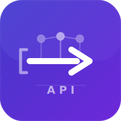
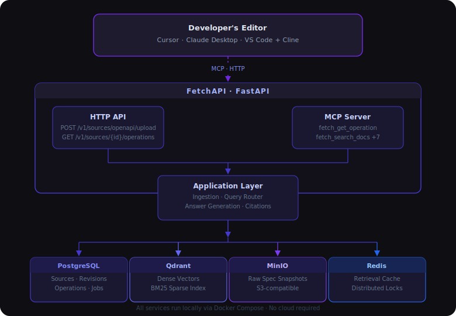

<div align="center">



# FetchAPI

Give your AI coding assistant accurate, citation-backed knowledge of any API - no hallucinations, no pasted docs, no cloud subscription.

[](https://www.python.org/)
[](https://fastapi.tiangolo.com/)
[](https://docs.docker.com/)
[](https://www.openapis.org/)
[](https://modelcontextprotocol.io/)
[](LICENSE)

[Getting Started](#getting-started) · [MCP Tools](#mcp-tools) · [HTTP API](#http-api) · [Architecture](#architecture) · [Roadmap](#roadmap)

</div>

---

## What It Covers

- **OpenAPI Ingestion**: Upload a spec file or URL - FetchAPI parses, validates, and normalizes it into a versioned canonical model.
- **Hybrid Retrieval**: Dense vector search, BM25 sparse index, RRF fusion, and cross-encoder reranking over operations, schemas, and auth schemes.
- **Grounded Q&A**: Every answer cites the exact spec section it came from. No hallucinated endpoints, no invented parameter names.
- **MCP Server**: Nine structured tools your AI coding assistant can call directly from Cursor, Claude Desktop, or VS Code + Cline.
- **Revision Lifecycle**: Re-ingest anytime - idempotent by design, with atomic activation so queries never see a partial index.

---

## Demo

> Demo recording coming in Phase 8 (Next.js UI). The HTTP API and MCP server are fully functional today.

```bash
# Upload Stripe's OpenAPI spec
curl -X POST http://localhost:8000/v1/sources/openapi/url \
  -H "Content-Type: application/json" \
  -d '{"name": "Stripe API", "url": "https://raw.githubusercontent.com/stripe/openapi/master/openapi/spec3.json"}'

# In Cursor, ask your AI assistant:
# "How do I create a payment intent with automatic confirmation?"
# → Grounded answer with citation to the exact Stripe spec section
```

---

## Getting Started

### Prerequisites

- [Docker](https://docs.docker.com/get-docker/) and Docker Compose
- An API key for an OpenAI-compatible LLM and embeddings provider
  - [NVIDIA NIM](https://build.nvidia.com/) - default (free tier available)
  - Or: OpenAI, Ollama, any OpenAI-compatible endpoint

### 1. Clone and configure

```bash
git clone https://github.com/your-username/fetchapi.git
cd fetchapi
cp .env.example .env
```

Open `.env` and set your provider credentials:

```env
LLM_API_KEY=your-api-key
EMBEDDINGS_API_KEY=your-api-key
RERANKER_API_KEY=your-api-key
```

Everything else works out of the box for local development.

### 2. Start the stack

```bash
docker compose up -d
```

This starts PostgreSQL, Qdrant, Redis, MinIO, and the FastAPI server. Database migrations run automatically on first start.

```bash
docker compose ps   # verify all services are healthy
```

### 3. Upload an OpenAPI spec

**From a file:**

```bash
curl -X POST http://localhost:8000/v1/sources/openapi/upload \
  -F "name=My API" \
  -F "file=@openapi.yaml"
```

**From a URL:**

```bash
curl -X POST http://localhost:8000/v1/sources/openapi/url \
  -H "Content-Type: application/json" \
  -d '{"name": "Petstore", "url": "https://petstore3.swagger.io/api/v3/openapi.json"}'
```

**Poll until ingestion is complete:**

```bash
curl http://localhost:8000/v1/jobs/{job_id}
# "stage": "active" means ready
```

### 4. Connect your editor

<details>
<summary><strong>Claude Desktop</strong></summary>

Add to `~/Library/Application Support/Claude/claude_desktop_config.json`:

```json
{
  "mcpServers": {
    "fetchapi": {
      "url": "http://localhost:8000/mcp"
    }
  }
}
```

</details>

<details>
<summary><strong>Cursor</strong></summary>

Add to `.cursor/mcp.json` in your project root:

```json
{
  "mcpServers": {
    "fetchapi": {
      "url": "http://localhost:8000/mcp"
    }
  }
}
```

</details>

<details>
<summary><strong>VS Code + Cline</strong></summary>

Open Cline settings and add under MCP Servers:

```json
{
  "fetchapi": {
    "url": "http://localhost:8000/mcp"
  }
}
```

</details>

Your AI assistant now has structured knowledge of every API you've uploaded.

---

## MCP Tools

Nine focused tools your AI assistant can call:

| Tool | What it does |
|---|---|
| `fetch_list_sources` | List all ingested APIs with their revision status |
| `fetch_search_docs` | Hybrid search across operations, schemas, and guides |
| `fetch_get_operation` | Full operation detail - parameters, request body, responses, auth |
| `fetch_get_schema` | Full schema definition with all properties and constraints |
| `fetch_get_auth` | Auth schemes for a source - type, scopes, header names |
| `fetch_generate_integration` | Generate working code for an endpoint in Python, TypeScript, or Java |
| `fetch_validate_request` | Validate a curl command or HTTP request against the spec |
| `fetch_explain_error` | Explain a status code or provider error code in context |
| `fetch_compare_versions` | Diff two revisions of the same API |

---

## HTTP API

Base URL: `http://localhost:8000`
Interactive docs: [`http://localhost:8000/docs`](http://localhost:8000/docs)

**Sources**

| Method | Endpoint | Description |
|---|---|---|
| `POST` | `/v1/sources/openapi/upload` | Upload an OpenAPI file (multipart) |
| `POST` | `/v1/sources/openapi/url` | Ingest from a URL |
| `GET` | `/v1/sources` | List all sources |
| `GET` | `/v1/sources/{id}` | Get one source |
| `GET` | `/v1/jobs/{id}` | Poll ingestion job status |

**Canonical entities**

| Method | Endpoint | Description |
|---|---|---|
| `GET` | `/v1/sources/{id}/operations` | List operations for the active revision |
| `GET` | `/v1/operations/{id}` | Full operation detail |
| `GET` | `/v1/sources/{id}/schemas` | List schemas for the active revision |
| `GET` | `/v1/schemas/{id}` | Full schema detail |
| `GET` | `/v1/sources/{id}/auth` | Auth schemes for the active revision |

---

## Architecture

<div align="center">

</div>

**Storage responsibilities:**
- **PostgreSQL** - source of truth for sources, revisions, canonical entities, ingestion jobs, and query traces
- **Qdrant** - dense vector and BM25 sparse index for hybrid retrieval with RRF fusion and cross-encoder reranking
- **MinIO** - immutable raw spec snapshots (S3-compatible, runs fully locally via Docker)
- **Redis** - retrieval and answer cache, distributed locks for stampede control

---

## Ingestion Pipeline

Every uploaded spec goes through a durable background pipeline:

```
QUEUED → FETCHING → SNAPSHOTTING → PARSING → VALIDATING → NORMALIZING → CHUNKING → EMBEDDING → INDEXING → VERIFYING → ACTIVE
                                                                                                                        ↓
                                                                                                                   (or FAILED)
```

| Stage | What happens |
|---|---|
| **FETCHING** | Load raw bytes from file upload or remote URL |
| **SNAPSHOTTING** | SHA-256 content hash + immutable copy stored in MinIO |
| **PARSING** | Safe YAML/JSON load with alias expansion limit; `$ref` resolution with SSRF protection and cycle detection |
| **VALIDATING** | OpenAPI 3.0/3.1 schema validation via `openapi-spec-validator` |
| **NORMALIZING** | Extract canonical entities: operations, schemas, auth schemes, servers, examples, error definitions |
| **CHUNKING** | Build self-contained text projections per entity; save chunks and typed relations to PostgreSQL |
| **EMBEDDING** | Embed all chunk texts via NVIDIA NIM in batches; one dense vector per chunk |
| **INDEXING** | Upsert chunks into Qdrant with deterministic point IDs; BM25 text index on chunk text field |
| **VERIFYING** | Count Qdrant points for this revision - must match expected chunk count before activation |
| **ACTIVE** | Atomic revision activation - previous revision marked superseded |

> **Idempotent by design.** Re-ingesting the same spec produces the same content hash and zero duplicate rows. A failed revision never replaces an active one.

---

## Security

- **SSRF protection** - external `$ref` URLs and redirect targets are checked against blocked IP ranges (loopback, private RFC-1918, link-local, IPv6 unique local) before fetching
- **DoS prevention** - YAML alias expansion is limited to 100 expansions per document (configurable), enforced on the raw node tree before construction
- **External ref limits** - max 3 hops, 1 MB per document, 10-second timeout
- **No code execution** - generated code is never executed on the host
- **No secret logging** - API keys and auth headers are never written to logs or stored in canonical entities

---

## Supported OpenAPI Versions

| Version | Status |
|---|---|
| OpenAPI 3.1.x | Supported |
| OpenAPI 3.0.x | Supported |
| Swagger 2.0 | Not supported |

---

## Configuration

All configuration is via environment variables. Copy `.env.example` to `.env` to get started.

<details>
<summary><strong>Using a different LLM provider</strong></summary>

FetchAPI defaults to NVIDIA NIM but works with any OpenAI-compatible provider. Change three variables:

```env
# OpenAI
LLM_BASE_URL=https://api.openai.com/v1
LLM_API_KEY=sk-...
LLM_MODEL_ID=gpt-4o

# Ollama (local)
LLM_BASE_URL=http://localhost:11434/v1
LLM_API_KEY=ollama
LLM_MODEL_ID=llama3.1:70b
```

No code changes required.

</details>

<details>
<summary><strong>Key environment variables</strong></summary>

```env
# LLM
LLM_BASE_URL=https://integrate.api.nvidia.com/v1
LLM_API_KEY=your-key
LLM_MODEL_ID=meta/llama-3.1-70b-instruct

# Embeddings
EMBEDDINGS_MODEL_ID=nvidia/nv-embedqa-e5-v5
EMBEDDINGS_DIMENSION=1024

# Ingestion limits
WORKER_INGESTION_MAX_ALIASES=100   # YAML alias expansion limit
WORKER_INGESTION_MAX_RETRIES=3     # retries before marking FAILED

# External $ref limits
EXT_REF_MAX_HOPS=3
EXT_REF_MAX_BYTES=1048576          # 1 MB
EXT_REF_TIMEOUT_SECONDS=10
```

See [`.env.example`](.env.example) for the full list.

</details>

---

## Development

### Setup

```bash
make install-dev    # create venv and install all dependencies including dev tools
make up             # start the Docker infrastructure
make migrate        # run Alembic migrations
make run            # start FastAPI with hot reload at localhost:8000
```

### Tests

```bash
make test-unit          # unit tests - no infrastructure required, runs in ~1s
make test-integration   # integration tests - requires running Docker stack
make test               # all tests
make test-cov           # with coverage report
```

### Code quality

```bash
make lint           # ruff check
make format         # ruff format
make typecheck      # mypy
make check          # lint + format check + typecheck (run before committing)
```

### Useful commands

```bash
make logs           # tail all Docker service logs
make db-shell       # psql into the running PostgreSQL container
make reset-db       # wipe all volumes and start fresh (destructive)
```

---

## Project Structure

```
fetchapi/
├── backend/
│   ├── src/fetch/
│   │   ├── api/v1/           # HTTP route handlers
│   │   ├── application/      # Use cases (ingestion, sources, retrieval, queries)
│   │   ├── domain/           # Entities, enums, errors, protocols - no framework deps
│   │   ├── infrastructure/   # PostgreSQL, Qdrant, Redis, MinIO, OpenAPI parsing, LLM
│   │   ├── mcp/              # MCP server and 9 tools
│   │   ├── workers/          # Reserved for future background work
│   │   └── config.py         # Pydantic settings with nested groups
│   ├── migrations/           # Alembic migrations (one per schema change)
│   └── tests/
│       ├── unit/             # Pure logic tests - no infrastructure
│       ├── integration/      # End-to-end tests against real stack
│       └── fixtures/         # Edge-case OpenAPI specs (recursive, nullable, invalid, etc.)
├── examples/
│   ├── petstore/             # OpenAPI 3.0.4  - 19 operations
│   ├── github/               # GHES 3.12      - 962 operations, 765 schemas
│   └── stripe/               # Stripe API     - 587 operations, 1,431 schemas
├── frontend/                 # Next.js web UI (Phase 8)
├── infra/
│   └── compose.yaml          # PostgreSQL · Qdrant · Redis · MinIO · FastAPI
├── docs/
├── .env.example
└── Makefile
```

---

## Roadmap

- [x] **Phase 0** - Foundation: domain model, provider protocols, configuration, fixture corpus
- [x] **Phase 1** - OpenAPI ingestion: parsing, validation, canonical extraction, job state machine, revision lifecycle
- [x] **Phase 2** - Chunking and vector indexing: operation/schema/auth chunk projections, Qdrant upsert, BM25 indexing
- [ ] **Phase 3** - Hybrid retrieval: dense + sparse + RRF fusion + cross-encoder reranking + relationship expansion
- [ ] **Phase 4** - Grounded Q&A: streamed answers with deterministic citation mapping, support status, abstention
- [ ] **Phase 5** - Integration code generation: Python, TypeScript, Java with spec-backed validation
- [ ] **Phase 6** - Request validation and error diagnosis: deterministic schema-backed validation, curl parsing
- [ ] **Phase 7** - MCP server: 9 structured tools wired to application services
- [ ] **Phase 8** - Next.js web UI: ingest, chat, explorer, validation panel, retrieval inspector
- [ ] **Phase 9** - Evaluation and hardening: Recall@K, MRR, citation precision, correct abstention rate
- [ ] **Phase 10** - Portfolio release: README, demo video, eval results, MCP quickstart guide

---

## Contributing

Contributions, issues, and feedback are welcome.

1. Fork the repository
2. Create a feature branch: `git checkout -b feature/your-feature`
3. Run `make check` (lint + type check) and `make test-unit` before submitting
4. Open a pull request with a clear description of what changed and why

Please open an issue before starting work on a significant change.

---

## License

[MIT](LICENSE) - free to use, modify, and distribute.
