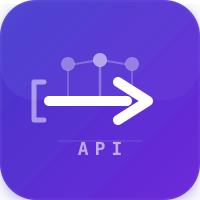
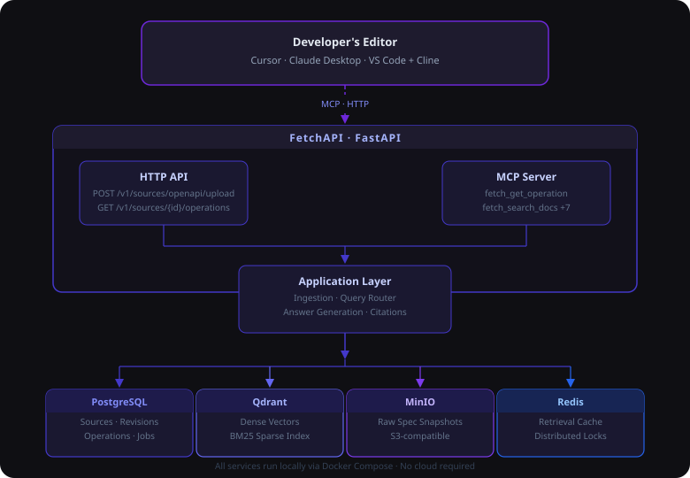

<div align="center">



# FetchAPI

**AI coding assistants hallucinate API details because they have no reliable, structured access to API documentation.**

FetchAPI fixes this. Upload an OpenAPI spec, connect your editor via MCP, and your AI assistant gets citation-backed, version-aware knowledge of that API — no cloud, no subscription, no pasted docs.

[](https://www.python.org/)
[](https://fastapi.tiangolo.com/)
[](https://nextjs.org/)
[](https://docs.docker.com/)
[](https://www.openapis.org/)
[](https://modelcontextprotocol.io/)
[](LICENSE)

[Getting Started](#getting-started) · [Features](#features) · [MCP Tools](#mcp-tools) · [HTTP API](#http-api) · [Architecture](#architecture) · [Evaluation](#evaluation) · [Development](#development) · [Roadmap](#roadmap)

</div>

---

## The Problem

When a developer asks their AI coding assistant "how do I create a payment intent with idempotency?" they might get a plausible-looking answer with invented parameter names, deprecated fields, or a request body that does not match the current spec. The model has no reliable source of truth — it interpolates from training data that may be months or years out of date.

FetchAPI is a self-hosted MCP server and API documentation intelligence layer. It ingests OpenAPI specs, extracts a structured canonical model, builds a hybrid retrieval index, and exposes nine focused MCP tools. Every answer cites the exact spec section it came from. When evidence is insufficient, it says so instead of hallucinating.

---

## Features

**OpenAPI ingestion pipeline — 11 deterministic stages**

Upload a file or point at a URL. FetchAPI runs a durable 11-stage background pipeline: safe YAML/JSON loading with alias-expansion DoS protection, SSRF-guarded `$ref` resolution, OpenAPI 3.0/3.1 schema validation, canonical entity extraction (operations, schemas, auth schemes, servers, examples, error definitions), self-contained chunk projection, dense embedding via NVIDIA NIM, Qdrant upsert with BM25 text indexing, point count verification, and atomic revision activation. A failed revision never replaces an active one.

**Hybrid retrieval — three modes, one pipeline**

Queries flow through query normalization, exact path/method pattern matching against PostgreSQL, dense vector search (NVIDIA NIM embeddings + Qdrant ANN), BM25 sparse search (Qdrant text index), Reciprocal Rank Fusion combining both lists, cross-encoder reranking (NVIDIA NIM `/ranking`), relationship expansion (schema and auth chunks linked to top operations), and token-budget context packing. All three retrieval modes (dense, BM25, hybrid+rerank) are selectable for ablation testing.

**Grounded Q&A with deterministic citation extraction**

Answers are streamed via SSE. Citations are extracted deterministically from allowed source IDs returned by the model — the server owns the citation metadata and verifies every cited identifier. The model never invents citation URLs. When the retrieved context does not support the question, the answer carries a `SupportStatus.UNSUPPORTED` label and explicitly declines to speculate.

**Integration code generation**

Given an operation and a target language (Python, TypeScript, or Java), FetchAPI generates working integration code grounded in the spec — correct parameter names, auth headers, and request body shape. Generated code is validated against the spec schema before it is returned. It is never executed on the host.

**Request validation from curl commands**

Parse a curl command or raw HTTP request, match it to an operation in the ingested spec, validate parameters and request body against the documented schema, and return a corrected example when the input is invalid. Uses `jsonschema` validation against the canonical model — not LLM inference.

**Version comparison**

Diff two revisions of the same API. Added, removed, and changed operations and schemas are identified structurally, not by text diff. Results are surfaced through both the HTTP API and the `fetch_compare_versions` MCP tool.

**MCP server with 9 structured tools**

All application services are exposed through a Streamable HTTP MCP server at `/mcp`. Nine typed tools cover every retrieval and generation workflow. Any editor that supports MCP — Claude Desktop, Cursor, VS Code + Cline — can connect with three lines of JSON config.

**Next.js web UI**

Ingest sources, chat with grounded Q&A (SSE streaming + inline citations), browse extracted operations and schemas, generate integration code, validate curl commands, and inspect the retrieval trace (chunks returned, scores, citations matched) for any query.

**Workspace isolation**

Every vector query is scoped to a workspace, source, and revision. There is no cross-tenant data leakage path at the query layer.

---

## Getting Started

### Prerequisites

- [Docker](https://docs.docker.com/get-docker/) and Docker Compose
- An API key for an OpenAI-compatible LLM and embeddings provider
  - [NVIDIA NIM](https://build.nvidia.com/) — default (free tier available)
  - Or: OpenAI, Ollama, any OpenAI-compatible endpoint

### 1. Clone and configure

```bash
git clone https://github.com/your-username/fetchapi.git
cd fetchapi
cp .env.example .env
```

Open `.env` and set your provider credentials:

```env
LLM_API_KEY=your-api-key
EMBEDDINGS_API_KEY=your-api-key
RERANKER_API_KEY=your-api-key
```

Everything else works out of the box for local development.

### 2. Start the stack

```bash
docker compose up -d
```

This starts PostgreSQL, Qdrant, Redis, MinIO, and the FastAPI server. Database migrations run automatically on first start.

```bash
docker compose ps   # verify all services are healthy
```

### 3. Upload an OpenAPI spec

**From a file:**

```bash
curl -X POST http://localhost:8000/v1/sources/openapi/upload \
  -F "name=My API" \
  -F "file=@openapi.yaml"
```

**From a URL:**

```bash
curl -X POST http://localhost:8000/v1/sources/openapi/url \
  -H "Content-Type: application/json" \
  -d '{"name": "Stripe API", "url": "https://raw.githubusercontent.com/stripe/openapi/master/openapi/spec3.json"}'
```

**Poll until ingestion is complete:**

```bash
curl http://localhost:8000/v1/jobs/{job_id}
# "stage": "ACTIVE" means the index is live and queryable
```

### 4. Connect your editor

<details>
<summary><strong>Claude Desktop</strong></summary>

Add to `~/Library/Application Support/Claude/claude_desktop_config.json`:

```json
{
  "mcpServers": {
    "fetchapi": {
      "url": "http://localhost:8000/mcp"
    }
  }
}
```

Restart Claude Desktop. The nine FetchAPI tools will appear in the tool list.

</details>

<details>
<summary><strong>Cursor</strong></summary>

Add to `.cursor/mcp.json` in your project root:

```json
{
  "mcpServers": {
    "fetchapi": {
      "url": "http://localhost:8000/mcp"
    }
  }
}
```

</details>

<details>
<summary><strong>VS Code + Cline</strong></summary>

Open Cline settings and add under MCP Servers:

```json
{
  "fetchapi": {
    "url": "http://localhost:8000/mcp"
  }
}
```

</details>

Your AI assistant now has structured, citation-backed knowledge of every API you have uploaded.

---

## MCP Tools

Nine focused tools, each backed by a typed application service:

| Tool | What it does |
|---|---|
| `fetch_list_sources` | List all ingested APIs with their active revision status |
| `fetch_search_docs` | Hybrid search (dense + BM25 + RRF + rerank) across operations, schemas, and auth schemes |
| `fetch_get_operation` | Full operation detail — parameters, request body, responses, auth requirements |
| `fetch_get_schema` | Full schema definition with all properties, types, constraints, and examples |
| `fetch_get_auth` | Auth schemes for a source — type, scopes, header names, token endpoint |
| `fetch_generate_integration` | Generate spec-grounded integration code in Python, TypeScript, or Java |
| `fetch_validate_request` | Validate a curl command or HTTP request against the documented schema |
| `fetch_explain_error` | Explain a status code or provider error code in context of the spec |
| `fetch_compare_versions` | Structural diff of two revisions — added, removed, and changed operations and schemas |

---

## HTTP API

Base URL: `http://localhost:8000`
Interactive docs: [`http://localhost:8000/docs`](http://localhost:8000/docs)

**Sources and ingestion**

| Method | Endpoint | Description |
|---|---|---|
| `POST` | `/v1/sources/openapi/upload` | Upload an OpenAPI file (multipart/form-data) |
| `POST` | `/v1/sources/openapi/url` | Ingest from a remote URL |
| `GET` | `/v1/sources` | List all sources |
| `GET` | `/v1/sources/{id}` | Get one source with active revision |
| `GET` | `/v1/jobs/{id}` | Poll ingestion job status and current pipeline stage |

**Canonical entities**

| Method | Endpoint | Description |
|---|---|---|
| `GET` | `/v1/sources/{id}/operations` | List operations for the active revision |
| `GET` | `/v1/operations/{id}` | Full operation detail |
| `GET` | `/v1/sources/{id}/schemas` | List schemas for the active revision |
| `GET` | `/v1/schemas/{id}` | Full schema detail |
| `GET` | `/v1/sources/{id}/auth` | Auth schemes for the active revision |

**Retrieval and Q&A**

| Method | Endpoint | Description |
|---|---|---|
| `POST` | `/v1/query` | Grounded Q&A with SSE streaming and citation extraction |
| `POST` | `/v1/sources/{id}/search` | Hybrid retrieval — returns ranked chunks with scores |

**Generation and validation**

| Method | Endpoint | Description |
|---|---|---|
| `POST` | `/v1/integrations/generate` | Generate integration code for an operation |
| `POST` | `/v1/validate/request` | Validate a curl command against the spec |

---

## Architecture

<div align="center">

</div>

**Storage responsibilities**

| Store | Role |
|---|---|
| PostgreSQL | Source of truth — sources, revisions, canonical entities, ingestion jobs, query traces, chunk metadata |
| Qdrant | Rebuildable retrieval index — dense vectors (1024-dim) and BM25 text index; can be rebuilt from PostgreSQL |
| MinIO | Immutable raw spec snapshots — SHA-256 addressed, S3-compatible, runs locally via Docker |
| Redis | Retrieval and answer cache; distributed locks for stampede prevention |

**Clean layered architecture**

```
API / MCP entrypoints        (parse input, resolve auth, call one service, map errors)
         ↓
Application services         (orchestrate use cases, depend on domain protocols only)
         ↓
Domain entities / protocols  (entities, enums, errors, pure validation — zero framework imports)
         ↑
Infrastructure adapters      (PostgreSQL, Qdrant, Redis, MinIO, OpenAPI parsing, LLM/embeddings)
```

The domain layer has zero dependencies on FastAPI, SQLAlchemy, Qdrant, Redis, or any LLM SDK. Infrastructure adapters convert infrastructure exceptions to stable domain errors before crossing the boundary.

---

## Ingestion Pipeline

Every uploaded spec goes through a durable, idempotent 11-stage background pipeline:

```
QUEUED → FETCHING → SNAPSHOTTING → PARSING → VALIDATING → NORMALIZING
       → CHUNKING → EMBEDDING → INDEXING → VERIFYING → ACTIVE
                                                           ↓
                                                        (or FAILED)
```

| Stage | What happens |
|---|---|
| **FETCHING** | Load raw bytes from file upload or remote URL with timeout and size limits |
| **SNAPSHOTTING** | SHA-256 content hash; immutable copy stored in MinIO. Re-ingesting the same file is a no-op |
| **PARSING** | Safe YAML/JSON load with alias expansion capped at 100; `$ref` resolution with SSRF protection (blocked IP ranges checked before fetch) and cycle detection |
| **VALIDATING** | OpenAPI 3.0/3.1 schema validation via `openapi-spec-validator` |
| **NORMALIZING** | Extract canonical entities: operations (method, path, parameters, request body, responses), schemas, auth schemes, servers, examples, error definitions |
| **CHUNKING** | Build self-contained text projections per entity — method, path, summary, auth, parameters, required fields, responses. Save chunks and typed relations (OPERATION_USES_SCHEMA, OPERATION_REQUIRES_AUTH) to PostgreSQL |
| **EMBEDDING** | Batch-embed all chunk texts via NVIDIA NIM (`nvidia/nv-embedqa-e5-v5`, 1024-dim) with `input_type=passage` |
| **INDEXING** | Upsert chunks into Qdrant with deterministic point IDs derived from chunk UUID. BM25 text index on the `text` payload field |
| **VERIFYING** | Count Qdrant points for this revision. Must match expected chunk count before activation proceeds |
| **ACTIVE** | Atomic revision activation — previous revision marked SUPERSEDED in the same transaction |

Re-ingesting the same spec content (same SHA-256) skips the full pipeline and returns immediately. A failed revision never replaces an active one.

---

## Security

- **SSRF protection** — external `$ref` URLs and HTTP redirect targets are resolved to IP addresses via `socket.getaddrinfo()` and checked against blocked ranges (loopback, private RFC-1918, link-local, metadata service, multicast) before any network request is made
- **DoS prevention** — YAML alias expansion is capped at 100 expansions per document (configurable via `WORKER_INGESTION_MAX_ALIASES`), enforced on the raw node tree before `yaml.safe_load()` constructs Python objects
- **External ref limits** — max 3 hops, 1 MB per document, 10-second timeout per fetch
- **No code execution** — generated integration code is syntax-validated against the spec schema but never executed on the host
- **No secret logging** — API keys and authorization headers extracted from ingested specs are redacted before any log write
- **Workspace isolation** — every Qdrant query includes mandatory `workspace_id` and `revision_id` payload filters; cross-tenant leakage is blocked at the query layer
- **Prompt injection boundary** — ingested documentation content is treated as untrusted evidence, not instructions; the system prompt separates retrieved context from user instructions explicitly

Security tests covering SSRF (3 tests), workspace isolation (6 tests), and prompt injection boundaries (8 tests) run in CI on every push.

---

## Evaluation

Evaluation runners require a live stack with ingested sources. They are not part of the unit test suite and are not run in CI (which only runs unit and security tests).

```bash
# Run retrieval benchmark against ingested sources
python evals/runners/retrieval_benchmark.py --mode hybrid

# Run answer benchmark
python evals/runners/answer_benchmark.py

# Run validation benchmark
python evals/runners/validation_benchmark.py

# Side-by-side ablation across all three retrieval modes
python evals/runners/ablation_runner.py
```

The 90-question eval dataset (30 each for Petstore, Stripe, and GitHub; 5 abstention questions per set) is in `evals/datasets/`. Regression thresholds are in `evals/thresholds.json`.

**Retrieval benchmark** (target thresholds — run `evals/runners/retrieval_benchmark.py` to produce actual results)

| Dataset | Recall@5 | Recall@10 | MRR |
|---|---|---|---|
| Petstore | — | — | — |
| Stripe | — | — | — |
| GitHub | — | — | — |
| **Target** | **≥ 0.70** | **≥ 0.80** | **≥ 0.60** |

**Answer benchmark** (target thresholds)

| Metric | Target |
|---|---|
| Citation accuracy | ≥ 0.70 |
| Abstention accuracy | ≥ 0.85 |
| Groundedness | ≥ 0.70 |

**Validation benchmark** (target thresholds)

| Metric | Target |
|---|---|
| Finding precision | ≥ 0.75 |
| Finding recall | ≥ 0.70 |
| `is_valid` accuracy | ≥ 0.90 |

To fill in actual results, run the benchmark runners against a live instance with Petstore, Stripe, and GitHub ingested, then update this table.

---

## Configuration

All configuration is via environment variables. Copy `.env.example` to `.env` to get started.

<details>
<summary><strong>Using a different LLM provider</strong></summary>

FetchAPI defaults to NVIDIA NIM but works with any OpenAI-compatible provider. Change three variables:

```env
# OpenAI
LLM_BASE_URL=https://api.openai.com/v1
LLM_API_KEY=sk-...
LLM_MODEL_ID=gpt-4o

# Ollama (local)
LLM_BASE_URL=http://localhost:11434/v1
LLM_API_KEY=ollama
LLM_MODEL_ID=llama3.1:70b
```

No code changes required. The same swap applies to the embeddings provider via `EMBEDDINGS_BASE_URL`, `EMBEDDINGS_API_KEY`, `EMBEDDINGS_MODEL_ID`.

</details>

<details>
<summary><strong>Key environment variables</strong></summary>

```env
# LLM
LLM_BASE_URL=https://integrate.api.nvidia.com/v1
LLM_API_KEY=your-key
LLM_MODEL_ID=meta/llama-3.1-70b-instruct

# Embeddings
EMBEDDINGS_BASE_URL=https://integrate.api.nvidia.com/v1
EMBEDDINGS_API_KEY=your-key
EMBEDDINGS_MODEL_ID=nvidia/nv-embedqa-e5-v5
EMBEDDINGS_DIMENSION=1024

# Reranker (httpx direct — NIM /ranking endpoint is not OpenAI-compatible)
RERANKER_BASE_URL=https://integrate.api.nvidia.com/v1
RERANKER_API_KEY=your-key
RERANKER_MODEL_ID=nvidia/nv-rerankqa-mistral-4b-v3

# Ingestion limits
WORKER_INGESTION_MAX_ALIASES=100   # YAML alias expansion DoS cap
WORKER_INGESTION_MAX_RETRIES=3     # retries before marking FAILED

# External $ref limits
EXT_REF_MAX_HOPS=3
EXT_REF_MAX_BYTES=1048576          # 1 MB per fetched document
EXT_REF_TIMEOUT_SECONDS=10
```

See [`.env.example`](.env.example) for the full list.

</details>

---

## Development

### Setup

```bash
make install-dev    # create backend/.venv and install all dependencies including dev tools
make up             # start the Docker infrastructure (PostgreSQL, Qdrant, Redis, MinIO)
make migrate        # run Alembic migrations
make run            # start FastAPI with hot reload at localhost:8000
```

### Tests

```bash
make test-unit          # unit tests — no infrastructure required, runs in ~1s
make test-integration   # integration tests — requires running Docker stack
make test               # all tests (412 tests: unit + security)
make test-cov           # with coverage report
```

### Code quality

```bash
make lint           # ruff check
make format         # ruff format
make typecheck      # mypy
make check          # lint + format check + typecheck (run before committing)
```

### Useful commands

```bash
make logs           # tail all Docker service logs
make db-shell       # psql into the running PostgreSQL container
make reset-db       # wipe all volumes and start fresh (destructive)
```

---

## Project Structure

```
fetchapi/
├── backend/
│   ├── src/fetch/
│   │   ├── api/v1/           # HTTP route handlers — parse input, call service, map errors
│   │   ├── application/      # Use cases: ingestion, sources, retrieval, queries, generation, validation
│   │   ├── domain/           # Entities, enums, errors, protocols — zero framework imports
│   │   ├── infrastructure/   # PostgreSQL, Qdrant, Redis, MinIO, OpenAPI parsing, LLM/embeddings
│   │   ├── mcp/              # MCP server and 9 tools via Streamable HTTP
│   │   └── config.py         # Pydantic settings with nested groups
│   ├── migrations/           # Alembic migrations — one per schema change
│   └── tests/
│       ├── unit/             # Pure logic tests — no infrastructure
│       ├── integration/      # End-to-end tests against real stack
│       ├── security/         # SSRF, workspace isolation, prompt injection tests
│       └── fixtures/         # Edge-case OpenAPI specs (recursive, nullable, invalid, etc.)
├── examples/
│   ├── petstore/             # OpenAPI 3.0.4 — 19 operations
│   ├── github/               # GHES 3.12 — 962 operations, 765 schemas
│   └── stripe/               # Stripe API — 587 operations, 1,431 schemas
├── evals/
│   ├── datasets/             # 90-question eval datasets (petstore, stripe, github — 30 each)
│   ├── runners/              # retrieval, answer, validation, and ablation benchmark runners
│   ├── fixtures/             # validation fixtures (15 broken curl requests)
│   ├── results/              # benchmark output (gitignored)
│   └── thresholds.json       # Recall@5, Recall@10, MRR, citation accuracy regression thresholds
├── frontend/                 # Next.js 15 web UI
├── infra/
│   └── compose.yaml          # PostgreSQL · Qdrant · Redis · MinIO · FastAPI
├── docs/
│   └── assets/               # Logo SVG, architecture SVG
├── .env.example
└── Makefile
```

---

## Design Decisions

**PostgreSQL, not Qdrant, as source of truth.** Qdrant is a rebuildable retrieval index. If it is wiped, the entire index can be reconstructed from the canonical entities and chunk text stored in PostgreSQL. Storing authoritative data only in a vector database makes point-in-time recovery and schema migrations difficult.

**Hybrid retrieval, not dense-only.** Dense vector search excels at semantic similarity but misses exact method names, path segments, and parameter names. BM25 catches those. RRF fusion with cross-encoder reranking gives the best of both without requiring a separate sparse encoder fine-tuned to the domain.

**Deterministic citations, not model-generated.** The model is prompted to emit allowed source IDs from the retrieved context. The server maps those IDs to full citation metadata. This prevents the model from inventing citation URLs and ensures every citation in the response corresponds to a real chunk from the active revision.

**`asyncio.create_task`, not Celery.** The ingestion pipeline is I/O-bound (network fetches, database writes, embedding API calls). `asyncio.create_task()` in the FastAPI process is sufficient for the single-instance deployment target and eliminates a Redis broker, worker process, and failure-mode surface. The abstraction is in place to swap to a queue-based runner later.

**MCP, not just HTTP.** HTTP endpoints are the internal service boundary. MCP is the editor integration surface. Separating them means the nine tools can evolve their input schema and description independently of the REST API versioning, and any MCP-compatible client gets access without custom plugin code.

---

## Limitations and Future Work

- No live website crawling — HTML documentation pages are not supported; only file and URL-based OpenAPI ingestion
- No PDF ingestion
- No Swagger 2.0 support — OpenAPI 3.0.x and 3.1.x only
- No multi-user accounts or access control — single workspace, single tenant
- No generated-code execution sandbox — syntax validation only, no runtime testing
- No GraphQL, AsyncAPI, or Postman Collection support
- No fine-tuning — the LLM is used as-is with retrieval-augmented prompting
- Eval results table not yet filled — run `evals/runners/` against a live instance to generate real numbers

---

## Roadmap

- [x] **Phase 0** — Foundation: domain model, provider protocols, configuration, fixture corpus
- [x] **Phase 1** — OpenAPI ingestion: parsing, validation, canonical entity extraction, job state machine, revision lifecycle
- [x] **Phase 2** — Chunking and vector indexing: operation/schema/auth chunk projections, Qdrant upsert, BM25 indexing
- [x] **Phase 3** — Hybrid retrieval: dense + sparse + RRF fusion + cross-encoder reranking + relationship expansion
- [x] **Phase 4** — Grounded Q&A: streamed answers with deterministic citation mapping, SupportStatus, abstention
- [x] **Phase 5** — Integration code generation: Python, TypeScript, Java with spec-backed validation
- [x] **Phase 6** — Request validation and error diagnosis: deterministic schema-backed validation, curl parsing
- [x] **Phase 7** — MCP server: 9 structured tools via Streamable HTTP wired to application services
- [x] **Phase 8** — Next.js web UI: ingest, chat with SSE streaming + citations, explorer, validation panel, retrieval inspector
- [x] **Phase 9** — Evaluation and hardening: 90-question eval datasets, retrieval/answer/validation/ablation runners, SSRF + workspace isolation + prompt injection security tests, GitHub Actions CI
- [x] **Phase 10** — Portfolio release: README overhaul, resume bullets, MCP quickstart, eval thresholds documented

---

## License

[MIT](LICENSE) — free to use, modify, and distribute.
